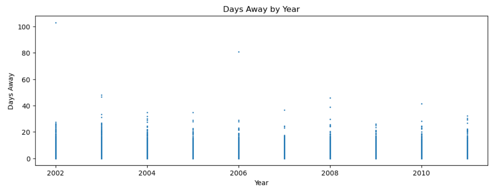
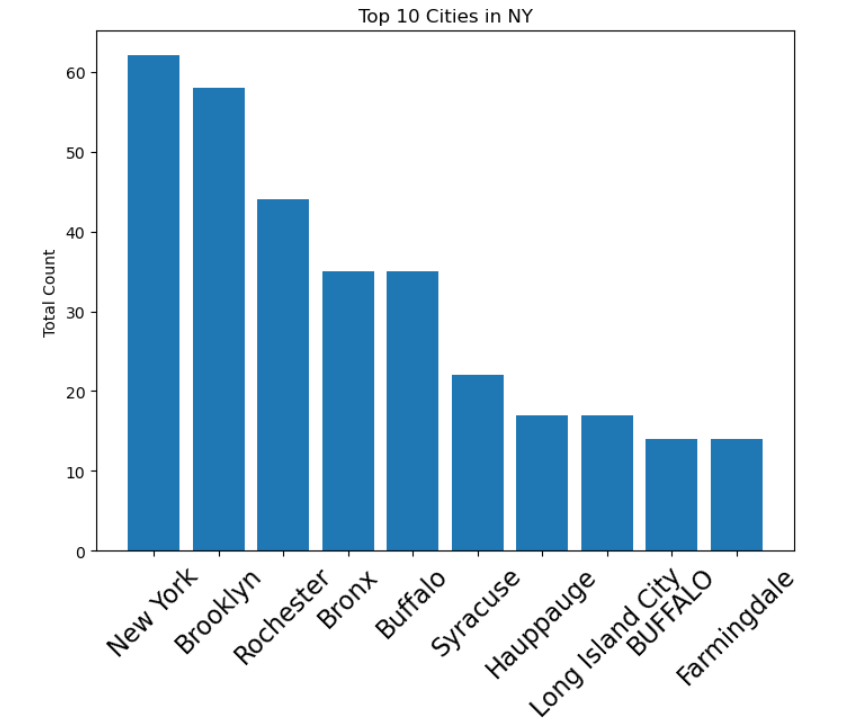

# Injuries in the U.S.
The Data i have collected and used goes back to 2002 and goes until 2011 and my data was collected from The Occupational Safety and Health Administration (OSHA) and has some limitations because some states or territories didn't participate in the data collection and those include Alaska; Oregon; Puerto Rico; South Carolina; Washington; Wyoming. In addition to that there was too much data in the original census that this data set only has rougly 4% of the original cenus and OSHA itself doesn't fully believe all of this data so some of it might not be truthful and the dtata only uses a small portion of data from the private sector. We are going to look through the data and see how much New York is affected by this data.

This shows just how much data is in just 4% of what OSHA collected and how many days were lost due to injury. There is some obvious outliers that OSHA probably assumes are not real data and that it was faked. This plot is only a small part of the overall data and we will examine it closer later in this article.

This shows how many days were lost from each state based on injury. There is still some outliers because the data was a collective census and not everyone was honest. There is also missing states because several states and territories didn't participate in the census. This data is still a bit too broad for what I want to analyze but in the next visualization we will see it.

Now we can see the data we actually wanat to see. We can now see the top 10 cities in New York with the most times they had a company report an injury. Based on this data we can see that New York has over 60 companies reported an injury from 2002 to 2011 and thats from 4% of the total data so some reports are probably lost. Based on this we can also see that there's a lot of data missing if such big cities only have between 15 and 60 injuries reported from 2002 to 2011.